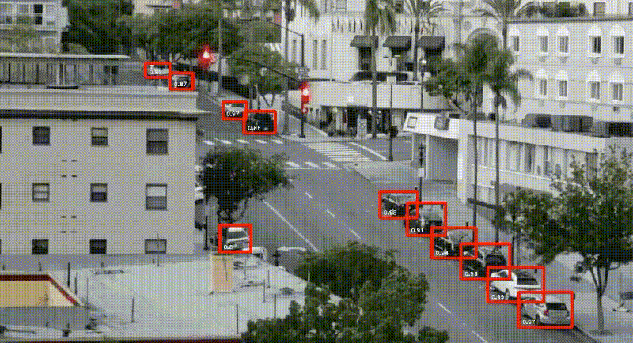

# deep-learning-based-parking-system-
Smart -Parking -System
Maintaining empty parking spot count using real-time vehicle detection. 
Due to occlusions (coming due to the presence of mirror in the middle of camera and parking lot which slightly reflects nearby people passing through), low resolution of video and positioning of cars at different angles in the parking lot and limitations of yolo, it cannot detect every car in all the frames and hence the count fluctuates.

Same is the case with Mask-RCNN. But for a different video with high resolution and less occlusions, the case becomes different. Note that in the video below, the moving car comes in front of the parked on for few seconds and thus YOLO couldn't detect the occluded car and the count changed. Other than that it worked fine for the resolution the video had. 

The problem can be broken into two parts detecting the parking slot location and detection occupancy within the slots. We can manually mark the areas of the parking lots but this is a cumbersome process which has to be repeated each time we change the camra position. A better approach will be identify the slots from the security cam footage itself. Subesquently each of the identified slots can call a classifier to detect the presence/  absence of a car.

